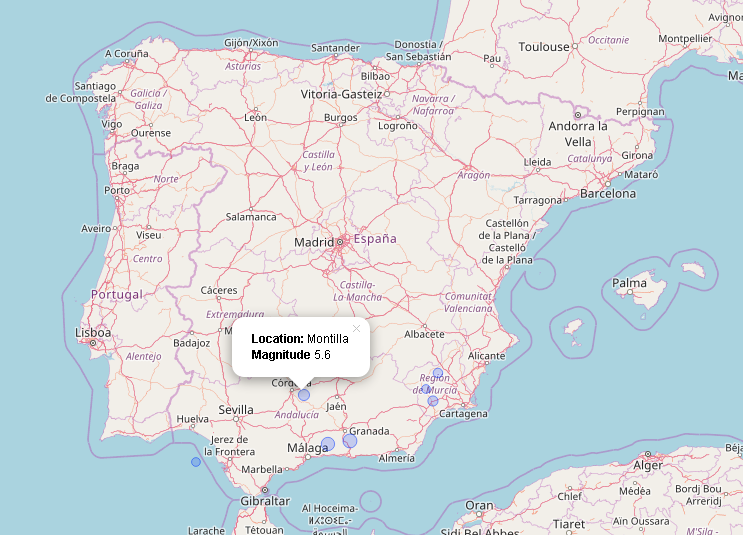

---
output:
  md_document:
    variant: markdown_github
---

<!-- README.md is generated from README.Rmd. Please edit that file -->

```{r, echo = FALSE}
knitr::opts_chunk$set(
  collapse = TRUE,
  comment = "#>",
  fig.path = "README-"
)
```

[](https://travis-ci.org/eregmig/earthquake)


# earthquake

Package for visualization of NOAA earthquakes. It processes data from [NOAA database](https://www.ngdc.noaa.gov/nndc/struts/form?t=101650&s=1&d=1).

## Installation

To install this package to run on your system, please first install and load the devtools package. Then you may install and load this package thus:

```{r install, echo = FALSE, eval=FALSE}
require(devtools)
devtools::install_github('eregmig/earthquake', build_vignettes = TRUE)
library(earthquake)
```

## Usage

This package allows you to get and clean the latest earthquake data from the NOAA's Webpage so as to prepare it for analysis:

```{r load_data, echo = FALSE}
library(earthquake)
library(dplyr)
library(lubridate)
data <- eq_clean_data()
```

Now that data can be visualize for a couple of countries like Greece and Italy over a period of time from 2000 to 2010 and show the names of the 2 locations with the worst earthquakes:

```{r timeline}
library(ggplot2)
data %>% 
  dplyr::filter(COUNTRY %in% c("GREECE", "ITALY")) %>%
  ggplot(aes(x = DATE, y = COUNTRY, color = TOTAL_DEATHS, size = EQ_PRIMARY, magnitude = EQ_PRIMARY, label = LOCATION_NAME)) +
  geom_timeline_label(xmin = "2000-01-01", xmax = "2010-01-01", n_max = 2, angle = 60) +
  geom_timeline(xmin = "2000-01-01", xmax = "2010-01-01") +
  theme_timeline()
```

Another function include in this library allows to see earth quakes on a map:

```{r map}
library(leaflet)
data %>% dplyr::filter(COUNTRY == "SPAIN") %>%
  dplyr::mutate(POPUP = eq_create_label(.)) %>%
  eq_map(annot_col = "POPUP")
```

