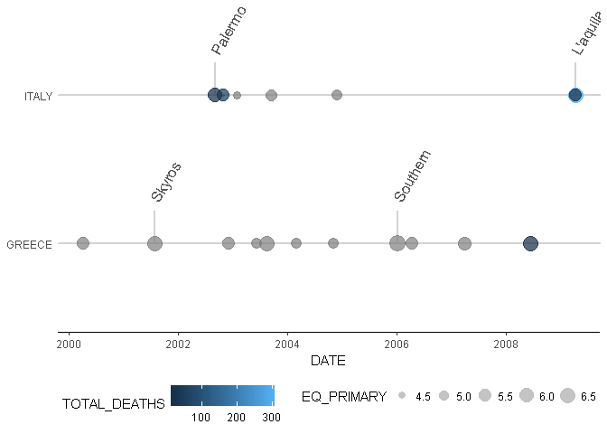

<!-- README.md is generated from README.Rmd. Please edit that file -->
[](https://travis-ci.org/eregmig/earthquake)

earthquake
==========

Package for visualization of NOAA earthquakes. It processes data from [NOAA database](https://www.ngdc.noaa.gov/nndc/struts/form?t=101650&s=1&d=1).

Installation
------------

To install this package to run on your system, please first install and load the devtools package. Then you may install and load this package thus:

    #> Loading required package: devtools
    #> Downloading GitHub repo eregmig/earthquake@master
    #> from URL https://api.github.com/repos/eregmig/earthquake/zipball/master
    #> Installing earthquake
    #> "C:/PROGRA~1/R/R-34~1.3/bin/x64/R" --no-site-file --no-environ --no-save  \
    #>   --no-restore --quiet CMD build  \
    #>   "C:\Users\eregmig\AppData\Local\Temp\RtmpOqXmka\devtoolsa0ce3e2cb6\eregmig-earthquake-8c6a29a"  \
    #>   --no-resave-data --no-manual
    #> 
    #> "C:/PROGRA~1/R/R-34~1.3/bin/x64/R" --no-site-file --no-environ --no-save  \
    #>   --no-restore --quiet CMD INSTALL  \
    #>   "C:/Users/eregmig/AppData/Local/Temp/RtmpOqXmka/earthquake_0.1.0.tar.gz"  \
    #>   --library="C:/Users/eregmig/Documents/R/win-library/3.4"  \
    #>   --install-tests
    #> 

Usage
-----

This package allows you to get and clean the latest earthquake data from the NOAA's Webpage so as to prepare it for analysis:

    #> 
    #> Attaching package: 'dplyr'
    #> The following objects are masked from 'package:stats':
    #> 
    #>     filter, lag
    #> The following objects are masked from 'package:base':
    #> 
    #>     intersect, setdiff, setequal, union
    #> 
    #> Attaching package: 'lubridate'
    #> The following object is masked from 'package:base':
    #> 
    #>     date
    #> Parsed with column specification:
    #> cols(
    #>   .default = col_integer(),
    #>   FLAG_TSUNAMI = col_character(),
    #>   SECOND = col_character(),
    #>   EQ_PRIMARY = col_character(),
    #>   EQ_MAG_MW = col_character(),
    #>   EQ_MAG_MS = col_character(),
    #>   EQ_MAG_MB = col_character(),
    #>   EQ_MAG_ML = col_double(),
    #>   EQ_MAG_MFA = col_character(),
    #>   EQ_MAG_UNK = col_character(),
    #>   COUNTRY = col_character(),
    #>   STATE = col_character(),
    #>   LOCATION_NAME = col_character(),
    #>   LATITUDE = col_character(),
    #>   LONGITUDE = col_character(),
    #>   DEATHS = col_character(),
    #>   MISSING = col_character(),
    #>   INJURIES = col_character(),
    #>   DAMAGE_MILLIONS_DOLLARS = col_character(),
    #>   TOTAL_DEATHS = col_character(),
    #>   TOTAL_MISSING = col_character()
    #>   # ... with 2 more columns
    #> )
    #> See spec(...) for full column specifications.

Now that data can be visualize for a couple of countries like Greece and Italy over a period of time from 2000 to 2010 and show the names of the 2 locations with the worst earthquakes:

``` r
library(ggplot2)
data %>% 
  dplyr::filter(COUNTRY %in% c("GREECE", "ITALY")) %>%
  ggplot(aes(x = DATE, y = COUNTRY, color = TOTAL_DEATHS, size = EQ_PRIMARY, magnitude = EQ_PRIMARY, label = LOCATION_NAME)) +
  geom_timeline_label(xmin = "2000-01-01", xmax = "2010-01-01", n_max = 2, angle = 60) +
  geom_timeline(xmin = "2000-01-01", xmax = "2010-01-01") +
  theme_timeline()
```



Another function include in this library allows to see earth quakes on a map:

``` r
library(leaflet)
data %>% dplyr::filter(COUNTRY == "SPAIN") %>%
  dplyr::mutate(POPUP = eq_create_label(.)) %>%
  eq_map(annot_col = "POPUP")
```


